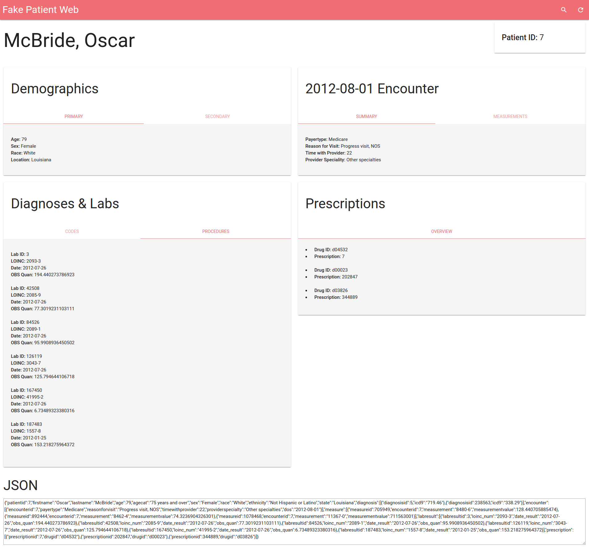

_...this project is in the early stages..._

# FakePatientWeb.com

FakePatientWeb shows a realistic fake patient record in a nice UI as well as in JSON form. 300,000 NAMCS records are used as the data source.

## Setup

1. Clone `johnschrom/ambulatory-ehr-data` and this repo, combining their contents
2. `bash build-sqlite.sh`
3. `node gen.js`
4. Wait several hours for the cache to be built up
5. `node server.js`

## TODOs

- Support multiple encounters
- See if NAMCS has encounter notes and/or forms
- Enable search
- Buy domain
- Deploy to Digital Ocean
- Test install steps
- Improve UI/UX
- Redirect non `/` requests to `/`
- Support HL7/FHIR export

## License

MIT
